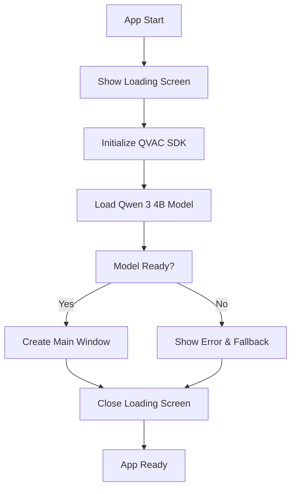

# LLM Desktop - AI-Powered Code Assistant

A powerful cross-platform Electron desktop application that combines local AI inference with an intuitive code editor. Built with **QVAC SDK** for offline AI capabilities, React + Vite for the UI, and an embedded Express server for script management. Generate, edit, and run scripts with the help of a locally-running AI assistant.

## 🚀 Key Features

### 🤖 **Local AI with QVAC Integration**
- **Offline AI inference** using QVAC SDK - no internet required for AI features
- **Fast, local model loading** with Qwen 3 4B Q4 quantized model
- **Real-time code generation** and transformation
- **Privacy-first approach** - your code never leaves your machine

### 📝 **Intelligent Script Management**
- **AI-powered script generation**: Describe what you want; get runnable code instantly
- **Smart code editing** with syntax highlighting and auto-completion
- **Contextual AI assistance** for code refactoring and improvements
- **Multi-language support**: Python, JavaScript, TypeScript, Bash, Go, Rust, and more

### ⚡ **Advanced Execution Environment**
- **Integrated terminal** with command history and auto-completion
- **Smart dependency detection** and auto-installation for missing packages
- **Real-time output streaming** with error handling and suggestions
- **Cross-platform script execution** with runtime detection

### 🔍 **Powerful Search & Organization**
- **Semantic search** across code, comments, and explanations
- **Tag-based organization** with auto-tagging
- **File system integration** with your chosen storage directory
- **Quick preview** of code snippets and explanations

## 🎯 QVAC Advantages

### **Why QVAC Over Cloud APIs?**

| Feature | QVAC (Local) | Cloud APIs |
|---------|--------------|------------|
| **Privacy** | ✅ Complete privacy - code never leaves your machine | ❌ Code sent to external servers |
| **Speed** | ✅ Sub-second inference after model load | ❌ Network latency + API delays |
| **Cost** | ✅ One-time setup, no ongoing costs | ❌ Pay-per-token pricing |
| **Offline** | ✅ Works without internet connection | ❌ Requires stable internet |
| **Reliability** | ✅ No rate limits or service outages | ❌ Subject to API limits and downtime |
| **Customization** | ✅ Fine-tune model parameters locally | ❌ Limited to provider's configurations |

### **Technical Benefits**

- **🔒 Zero Data Leakage**: Your proprietary code and sensitive information never leave your local environment
- **⚡ Ultra-Low Latency**: Direct model inference without network round-trips
- **💰 Cost Effective**: No per-request charges or subscription fees
- **🛡️ Enterprise Ready**: Perfect for organizations with strict data governance policies
- **🔧 Customizable**: Adjust model parameters (temperature, top-p, context size) for your specific needs
- **📱 Resource Efficient**: Optimized quantized models that run efficiently on consumer hardware

---

## 🚀 Getting Started

### System Requirements

#### **Minimum Requirements**
- **OS**: Windows 10+, macOS 10.15+, or Linux (Ubuntu 18.04+)
- **RAM**: 8GB (4GB for QVAC model + 4GB for system/app)
- **Storage**: 5GB free space (3GB for model + 2GB for app)
- **CPU**: x64 processor with AVX support

#### **Recommended Requirements**
- **RAM**: 16GB+ for optimal performance
- **Storage**: SSD for faster model loading and file operations
- **CPU**: Modern multi-core processor (Intel i5/AMD Ryzen 5 or better)

### Prerequisites

- **Node.js 18+** and npm
- **Optional Runtimes**: Install languages you plan to use:
  - Python 3.8+ for `.py` scripts
  - Node.js for `.js`/`.ts` scripts  
  - Bash/Zsh for shell scripts
  - Go, Rust, Java, etc. for respective file types

### Install dependencies

- Root dependencies:

```bash
npm install
```

- Renderer dependencies:

```bash
cd renderer && npm install
```

### Development

Start the React dev server and Electron together:

```bash
npm run dev
```

This runs:

- `renderer`: Vite dev server at `http://localhost:5173`
- `electron`: Electron with live reload, waiting for the renderer

### Build a production app

```bash
npm run build
```

This will:

- Build the renderer UI
- Package the Electron app with electron‑builder into `dist/`

Artifacts will be generated per platform (e.g., macOS `.dmg`, Windows `nsis`, Linux `AppImage`). App icons are in `assets/`.

---

## ⚙️ Configuration

### Environment Variables

Set these in a `.env` file at the project root or in your shell.

- `PORT`: Optional, Express server port (defaults to `8787`)

### QVAC Model Configuration

The application uses the **Qwen 3 4B Q4** quantized model by default, which provides an excellent balance of performance and resource usage. The model configuration can be found in `server/api.js`:

```javascript
const modelConfig = {
  ctx_size: 8192,        // Context window size
  temperature: 0.1,      // Creativity level (0.0-1.0)
  top_p: 0.9,           // Nucleus sampling
  top_k: 40,            // Top-k sampling
  repeat_penalty: 1.1,   // Repetition penalty
  n_predict: 512        // Max tokens to generate
}
```

### Model Loading Process

The app features a sophisticated initialization flow:

1. **Loading Screen**: Professional loading interface with progress indicators
2. **Background Initialization**: QVAC model loads in the background
3. **Status Broadcasting**: Real-time status updates via IPC
4. **Graceful Fallback**: Error handling if model loading fails
5. **Main UI**: Appears only after successful initialization

### Storage Configuration

- Choose any directory on your system for script storage
- The app creates a JSON index for fast searching
- All files remain in your chosen directory for easy access

---

## 🏗️ Architecture & Project Structure

### **High-Level Architecture**

```
┌─────────────────────────────────────────────────────────────┐
│                    Electron Main Process                    │
│  ┌─────────────────┐  ┌─────────────────┐  ┌─────────────┐ │
│  │  Window Manager │  │  QVAC SDK       │  │ IPC Handlers│ │
│  │  - Loading UI   │  │  - Model Load   │  │ - File Ops  │ │
│  │  - Main Window  │  │  - Inference    │  │ - Commands  │ │
│  └─────────────────┘  └─────────────────┘  └─────────────┘ │
└─────────────────────────────────────────────────────────────┘
                              │
                    ┌─────────┴─────────┐
                    │   Express Server   │
                    │  ┌─────────────────┐│
                    │  │ QVAC Integration││
                    │  │ - AI Routes     ││
                    │  │ - Script CRUD   ││
                    │  └─────────────────┘│
                    └───────────────────────┘
                              │
┌─────────────────────────────────────────────────────────────┐
│                    React Renderer Process                   │
│  ┌─────────────┐ ┌─────────────┐ ┌─────────────┐ ┌────────┐ │
│  │   Sidebar   │ │   Editor    │ │  Assistant  │ │Terminal│ │
│  │ - Scripts   │ │ - Monaco    │ │ - AI Chat   │ │- Output│ │
│  │ - Search    │ │ - Syntax    │ │ - Transform │ │- Shell │ │
│  └─────────────┘ └─────────────┘ └─────────────┘ └────────┘ │
└─────────────────────────────────────────────────────────────┘
```

### **Directory Structure**

```
coding-ai-agent/
├── assets/                    # Application icons and resources
│   ├── icon.icns             # macOS app icon
│   ├── icon.ico              # Windows app icon
│   └── icon.png              # Linux app icon
│
├── renderer/                  # Frontend React application
│   ├── public/               # Static assets
│   ├── src/                  # React components and logic
│   │   ├── components/       # Reusable UI components
│   │   │   ├── AskToolbar.jsx       # Natural language prompt interface
│   │   │   ├── AssistantPane.jsx    # AI chat for code transformation
│   │   │   ├── EditorPane.jsx       # Monaco-based code editor
│   │   │   ├── FileBar.jsx          # File navigation bar
│   │   │   ├── Sidebar.jsx          # Script browser and search
│   │   │   ├── TerminalPane.jsx     # Integrated terminal
│   │   │   ├── ToastProvider.jsx    # Toast notification provider
│   │   │   ├── toastContext.js      # Toast context
│   │   │   └── useToast.js          # Toast hook
│   │   ├── lib/              # Shared utilities and hooks
│   │   │   └── api.js        # API communication layer
│   │   ├── App.jsx           # Main application component
│   │   ├── main.jsx          # React app entry point
│   │   └── index.css         # Global styles
│   ├── eslint.config.js      # ESLint configuration
│   ├── package.json          # Frontend dependencies
│   └── vite.config.js        # Vite build configuration
│
├── server/                   # Backend services and API
│   ├── controllers/          # Request handlers
│   │   └── scriptsController.js # Script management logic
│   ├── routes/               # API route definitions
│   │   ├── ai.js            # AI endpoints for QVAC integration
│   │   └── scripts.js       # Script CRUD endpoints
│   ├── services/            # Business logic services
│   │   ├── ai/              # AI-related services
│   │   │   └── generationService.js  # AI code generation
│   │   ├── process/         # Process management
│   │   │   └── runManager.js # Script execution and logging
│   │   ├── processes/       # Additional process utilities
│   │   └── scripts/         # Script-related services
│   ├── utils/               # Shared utilities
│   │   └── codeUtils.js     # Code processing helpers
│   ├── api.js               # Express server setup with QVAC
│   └── storage.js           # File system operations and indexing
│
├── scripts/                  # Build and utility scripts
├── main.js                   # Electron main process
├── preload.js               # Secure IPC bridge (contextIsolation)
├── loading.html             # QVAC initialization loading screen
├── index.html               # Main application HTML
├── test-api-endpoints.js    # API testing utilities
├── webpack.main.config.js   # Webpack config for main process
├── webpack.renderer.config.js # Webpack config for preload script
├── .gitignore              # Git ignore rules
├── .npmrc                  # NPM configuration
├── package.json            # Main dependencies and build scripts
├── package-lock.json       # Dependency lock file
├── LICENSE                 # MIT license
└── README.md               # This documentation
```

### **Key Components**

#### **Frontend Components**
- **`Sidebar`** — Script browser, search, and storage management
- **`AskToolbar`** — Natural language prompt interface for script generation
- **`EditorPane`** — Monaco-based code editor with syntax highlighting
- **`AssistantPane`** — Contextual AI chat for code transformation
- **`TerminalPane`** — Integrated terminal with command execution and output

#### **Backend Services**
- **`QVAC Integration`** — Local AI model management and inference
- **`Script Management`** — File operations, indexing, and metadata
- **`Code Execution`** — Multi-language script runner with auto-dependency detection

---

## 🔧 How It Works

### **QVAC Initialization Flow**

The application implements a sophisticated startup sequence to ensure the AI model is ready before user interaction:



### **Electron Main Process (`main.js`)**

- **Window Management**: Creates loading screen first, then main window after QVAC initialization
- **QVAC Integration**: Manages model loading with progress tracking and error handling
- **IPC Handlers**: Exposes secure APIs via `preload.js`:
  - File operations: `run-command`, `list-dir`, `read-preview`, `save-file`
  - Storage management: `select-storage-dir`, `get-storage-dir`
  - Indexing: `index-dir`, `search-index`
  - QVAC status: `get-qvac-status`, `onQvacStatusChange`
- **API Server**: Boots embedded Express server with QVAC client on port `8787`

### **QVAC-Powered API Server (`server/`)**

#### **Core API (`api.js`)**
- Initializes QVAC SDK with optimized model configuration
- Provides Express app with CORS and JSON parsing
- Mounts specialized routers with shared QVAC client instance

#### **AI Routes (`routes/ai.js`)**
- **`POST /api/ai/transform`** — Contextual code transformation using QVAC
  - Takes current code and natural language prompt
  - Returns modified code with explanation
  - Uses local inference for privacy and speed

#### **Script Management (`routes/scripts.js`)**
- **`POST /api/scripts`** — AI-powered script generation via QVAC
- **`GET /api/scripts`** — List all scripts with metadata
- **`GET /api/scripts/:id`** — Retrieve specific script and metadata
- **`PUT /api/scripts/:id`** — Update script code
- **`POST /api/scripts/:id/run`** — Execute script with runtime detection

#### **Search (`api.js`)**
- **`GET /api/search`** — Semantic search across scripts with ranking
- Searches through code, comments, explanations, and tags
- Returns previews and relevance scores

### **React Frontend (`renderer/`)**

- **Modern Stack**: Built with React 19 + Vite 7 and Tailwind 4
- **API Communication**: Communicates with QVAC backend via `renderer/src/lib/api.js`
- **Real-time Updates**: Live status updates during QVAC initialization
- **Responsive Design**: Adaptive UI that works across different screen sizes

---

## 🚀 QVAC Features in Detail

### **Local AI Model Capabilities**

- **Code Generation**: Creates complete, runnable scripts from natural language descriptions
- **Code Transformation**: Refactors, optimizes, and modifies existing code contextually
- **Multi-language Support**: Understands and generates code in 20+ programming languages
- **Contextual Understanding**: Maintains context of your current project and coding patterns

### **Advanced AI Features**

- **Smart Error Detection**: Identifies common coding errors and suggests fixes
- **Dependency Management**: Automatically detects and suggests missing dependencies
- **Code Optimization**: Suggests performance improvements and best practices
- **Documentation Generation**: Creates explanations and comments for complex code

### **Privacy & Security**

- **Zero Network Dependency**: All AI processing happens locally on your machine
- **No Data Collection**: Your code and prompts never leave your device
- **Secure by Design**: No external API calls or data transmission for AI features
- **Enterprise Ready**: Meets strict corporate security and compliance requirements

---

## 📁 Storage Management

1. Open the app
2. Click to select a storage directory from the sidebar
3. New scripts and the index will be saved under that folder

The app reads/writes files directly to your chosen directory and maintains a small JSON index for metadata.

---

## Running scripts

The app chooses a run command based on file extension:

- `.py` → `python3 file.py`
- `.sh` → `bash file.sh`
- `.js` → `node file.js`
- `.ts` → `npx ts-node --transpile-only file.ts`
- `.rb`, `.php`, `.go`, `.java`, `.kt`, `.swift`, `.ps1`, `.pl`, `.rs` → appropriate commands

Make sure the corresponding runtime is installed and on your `PATH`.

---


## 📜 Available Scripts

### **Main Project Scripts** (`package.json`)

- `npm run dev` — Start development environment (Vite + Electron with live reload)
- `npm run dev:renderer` — Start only the React dev server (Vite)
- `npm run dev:electron` — Start only Electron (waits for renderer)
- `npm run build:ui` — Build the React UI for production
- `npm run build:main` — Build main process with webpack (optional)
- `npm run build:preload` — Build preload script with webpack (optional)
- `npm run build:webpack` — Build both main and preload with webpack
- `npm run build` — Build UI and package the desktop app for all platforms
- `npm run build:deb` — Build only .deb packages for Linux
- `npm run build:linux` — Build all Linux targets (AppImage + deb)
- `npm start` — Start the built Electron app

### **Renderer Scripts** (`renderer/package.json`)

- `npm run dev` — Vite development server
- `npm run build` — Vite production build
- `npm run preview` — Preview production build locally

---

## 📦 Deployment & Distribution

### **Webpack Configuration (Optional)**

The project includes optional webpack configurations for advanced bundling:

- **`webpack.main.config.js`** — Main process bundling with externals for native modules
- **`webpack.renderer.config.js`** — Preload script bundling with externals

These configurations handle:
- **Externals**: Prevents bundling of native modules (`@tetherto/qvac-sdk`, `bare-runtime-linux-x64`)
- **TypeScript Support**: Ready for TypeScript migration
- **Optimized Builds**: Production-ready bundling

### **Building for Production**

The app uses `electron-builder` for cross-platform packaging:

```bash
# Build for current platform
npm run build

# Build for specific platforms
npm run build -- --mac
npm run build -- --win
npm run build -- --linux

# Build specific Linux formats
npm run build:deb      # Debian packages only
npm run build:linux    # All Linux formats
```

### **Distribution Formats**

- **macOS**: `.dmg` installer with app bundle
- **Windows**: NSIS installer (`.exe`) with auto-updater support
- **Linux**: AppImage (portable) and `.deb` packages

### **App Signing & Notarization**

For production releases:

1. **Code Signing**: Configure certificates in `package.json` build section
2. **macOS Notarization**: Set up Apple Developer credentials
3. **Windows Signing**: Use Authenticode certificates for trust

### **Auto-Updates**

The app is configured for automatic updates using electron-updater:
- Updates check GitHub releases by default
- Configure update server in `package.json` publish section
- QVAC model updates handled separately from app updates

### **Performance Considerations**

- **First Launch**: Initial model download may take 5-10 minutes
- **Subsequent Launches**: Model loads from cache in 10-30 seconds
- **Memory Usage**: ~4GB RAM during active AI operations
- **Storage**: Model files cached in user data directory

---


## 📄 License

MIT License - See [LICENSE](LICENSE) file for details.

---

## 🙏 Acknowledgments

- **QVAC SDK** - For providing excellent local AI inference capabilities
- **Electron** - For enabling cross-platform desktop development
- **React & Vite** - For the modern, fast frontend development experience
- **Monaco Editor** - For the powerful code editing experience

---

*Built with ❤️ for developers who value privacy, performance, and local AI capabilities.*
